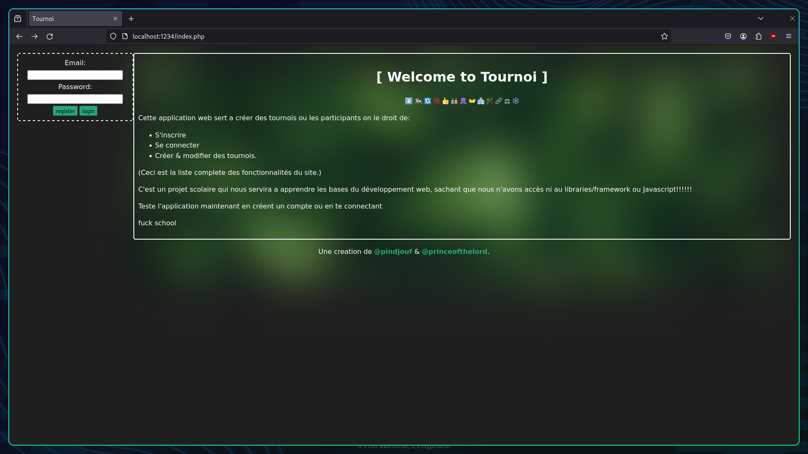

# tournoi

#️⃣ 🎠 🔃 🉐 👍 🎎 🐙 👐 🏥 🎋 🔗 ⚖ ❄️

## What is this?

This is a **simple web "app"** to learn the basics of web dev / CRUD. \
It was originally a school project that I forked from [princeofthelord](https://github.com/princeofthelord). But since he abandoned it, it's now my responsibility to finish it.

The original project had some restrictions to make sure that we really understand the basics, and don't rely on frameworks/libraries. But I might break that rule here and there.

### Things left to do:

- Set up auth
- Set up tournois
